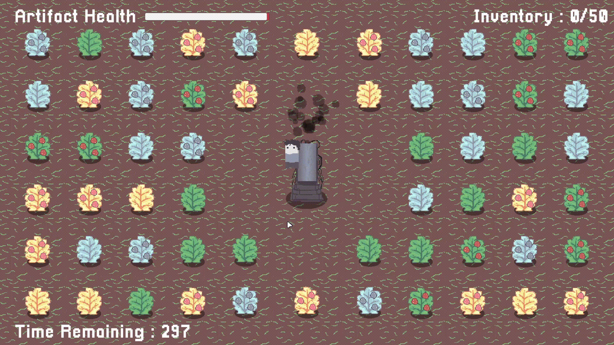
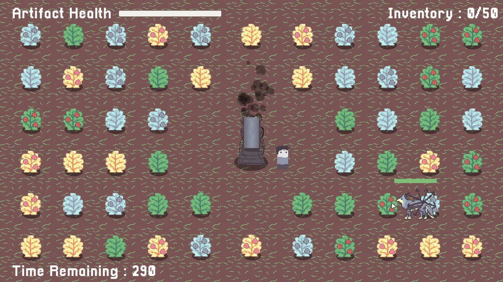

# The Artifact
Welcome to Artifact Defender, a 2D pixel art game created in Unity Engine! In this game, you take on the role of a guardian tasked with protecting a valuable Artifact from relentless wolves. Normal wolves will attack the Artifact directly, while eater wolves will destroy the bushes where you harvest essential berries. Your mission is to gather these berries and feed them to the Artifact to keep it safe, all while managing its health as it diminishes over time.

# Features
* **Pixel Art Visuals**: Immerse yourself in a charming 2D pixel art world where the game’s visual style brings the action to life.

* **Dynamic Wolf Threats**: Defend the Artifact from two types of wolves:
   - **Normal Wolves**: Directly attack the Artifact, posing a constant threat to its health.
   - **Eater Wolves**: Destroy the bushes, hindering your ability to gather necessary berries.

* **Berry Harvesting**: Collect berries from bushes to feed the Artifact and keep it healthy.

* **Health Management**: Monitor the Artifact’s health as it decreases over time and strategize to maintain its well-being.

* **Strategic Gameplay**: Balance between protecting the Artifact, harvesting berries, and managing the destruction caused by eater wolves.

* **Progressive Difficulty**: Experience increasing challenges as you advance, with more aggressive wolves and greater demands on your strategy.

# Screenshots




# Installation
* Download the latest release of game from [releases](https://github.com/thebenzo/TheArtifact/releases/).
* Unzip files and run ```The Artifact.exe```.
